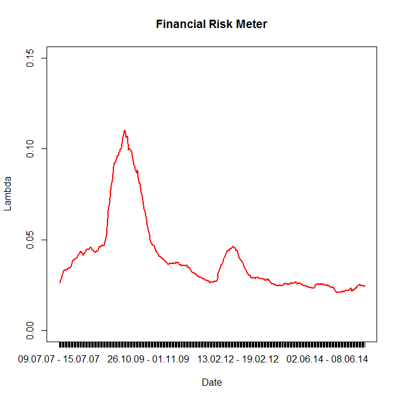

[](http://quantlet.de/index.php?p=info)

## [](http://quantlet.de/) **GoogleCorrelateWords_and_FRMcomparison** [](http://quantlet.de/d3/ia)

```yaml

Name of QuantLet : GoogleCorrelateWords_and_FRMcomparison

Published in : Frühsignale für Änderungen von Konjunkturindikatoren durch Analysen von Big Data

Description : 'Finds the best linear model by choosing x regressors from an amount of n possible
variables. It fits the regressors with the dependent variable and shows different quality criteria
like R^2 and BIC-criteria. Additionally, it shows how to reduce the Google Correlate Dataset to
deselect useless words. In a further step a OLS regression summaries the results to give more
information about the model. Additionally, it plots a Heat-map of qualitative regressors and a
scatterplot with one selected regressor and the dependent variable.'

Keywords : 'regression, linear-regression, correlation, bic, R-squared, time-series, heat-map,
financial, linear-model, scatterplot, plot, graphical representation, data visualization, google,
google trends'

Author : Daniel Jacob

Datafile: 
- Lambda_Zeitreihe_Mai15_weekly.csv: 'Time-series of the Financial-Risk-Meter (FRM) values (weekly
periodicity from 07/07 - 15/05)'
- Google_Correlate_with_downturn.csv: 'Google Correlate Output. Shows the 100 highly correlated
search terms with the search term downturn. Time period in weekly periodicity from 04/01 - 15/03]'

Example: 
- 1: Time-series of the Financial-Risk-Meter (FRM) values (weekly periodicity from 07/07 - 15/05).
- 2: Heatmap of the BIC criterion depending on selected variables for the regression.
- 3: 'Scatter plot between the search term down economy and the time series of the Financial Risk
Meter.'

```




### R Code:
```r

# clear variables and close windows
rm(list = ls(all = TRUE))
graphics.off()

# install and load packages
libraries = c("bestglm")
lapply(libraries, function(x) if (!(x %in% installed.packages())) {
    install.packages(x)
})
lapply(libraries, library, quietly = TRUE, character.only = TRUE)

# load data
Lambda_mean = read.csv("Lambda_Zeitreihe_Mai15_weekly.csv", header = TRUE, sep = ";", dec = ",")
ctest = read.csv("Google_Correlate_with_downturn.csv", header = TRUE, sep = ";", dec = ",")

# Plot 1: Time-series of the Financial-Risk-Meter values
plot(Lambda_mean[, 2], type = "l", pch = 1, col = "red", xaxt = "n", xlab = "Date", 
    ylab = "Lambda", main = "Financial Risk Meter", ylim = c(0, 0.15), lwd = 2)
axis(1, at = c(1:nrow(Lambda_mean)), labels = Lambda_mean[, 1])

# 100 most correlated words with the term "downturn" from Google Trends
colnames(ctest)

# Erase / Deselect suspicious predictor variables
ctest_clean = subset(ctest, select = -c(acai, acai.berry, banorte.mexico, blow.ya.back.out, 
    X18.days.lyrics, motor.arcade, unknown, motorbike.games, te.regalo.amores.lyrics, 
    break.me.down.if.it.makes.you.feel.right, matlab.2008b, notepad.2008, lions.tigers.and.bears.lyrics, 
    unknown.1, vmware.server.2, saving.abel.18.days.lyrics, seether.breakdown.lyrics, 
    el.angel, rolling.turtle, killers.spaceman, eclipse.3.4.1, she.got.her.own, song.love.story, 
    hottest.only, got.her.own, filezilla.free, the.killers.spaceman, que.quede.claro, 
    netbeans.6.5, smallville.season.8.episode.guide, samsung.sway, acai.berry.reviews, 
    luna.eddy.lover, y.que.quede.claro, uphill.rush.game, founding.farmers.restaurant, 
    gorilla.zoe.lost, jeremy.camp.there.will.be.a.day, filezilla.free.download, casting.crowns.slow.fade, 
    thesaurus.free, my.story.by.sean.mcgee, cuidado.con.el.angel, ron.browz, uyg, 
    seether.breakdown, slow.fade, slow.fade.lyrics, smoking.my.cancer, economy.jokes, 
    lost.gorilla.zoe, framing.hanley.lollipop, pbwiki.login, tan.her.hide, slam.crunk, 
    socialvibe, alternext, gdp.2008, us.gdp.2008, mil.demonios, lost.by.gorilla.zoe, 
    synthasite.com, saving.abel.18.days), drop = TRUE)

# bestGLM Regression: Google Trends terms on the lambda time series of the Financial Risk Meter
regsub = regsubsets(x = ctest_clean[184:584, c(2:10)], y = Lambda_mean[1:401, 2], 
    nvmax = 4)
summary(regsub)
summary(regsub)$adjr2 # adjusted R-squared

# Plot 2: Heatmap of the BIC criterion depending on selected variables for the regression.
# The darker a rectangle, the higher is the probability, that the variable is included 
# in the model (ordered by the BIC criterion). The columns (x-axis) show the possible 
# variables for the model with respect to the BIP criterion.
dev.new()
plot(regsub, main = "Heatmap of the BIC criterion depending on selected variables for the regression")
summary(regsub)$bic
summary(regsub, all.best = TRUE, matrix = TRUE, matrix.logical = FALSE, df = NULL)

# Compare with Linear Regression Model down.economy -- FRM shifted 5 weeks
# backwards = down.economy shifted 5 weeks forwards (-5)
lm_down_eco = lm(Lambda_mean[1:401, 2] ~ ctest_clean[179:579, "down.economy"])
summary(lm_down_eco)

# Plot 3: Scatter plot between the search term „down economy“ and the time series of the Financial Risk Meter
dev.new()
plot(Lambda_mean[1:401, 2] ~ ctest_clean[181:581, "down.economy"],
    main = "Scatter plot between the search term „down economy“ and the time series of the Financial Risk Meter", 
    ylab = "Lambda time series (FRM)", xlab = "search term: 'down economy'")
abline(lm_down_eco, col = "red") 

```
