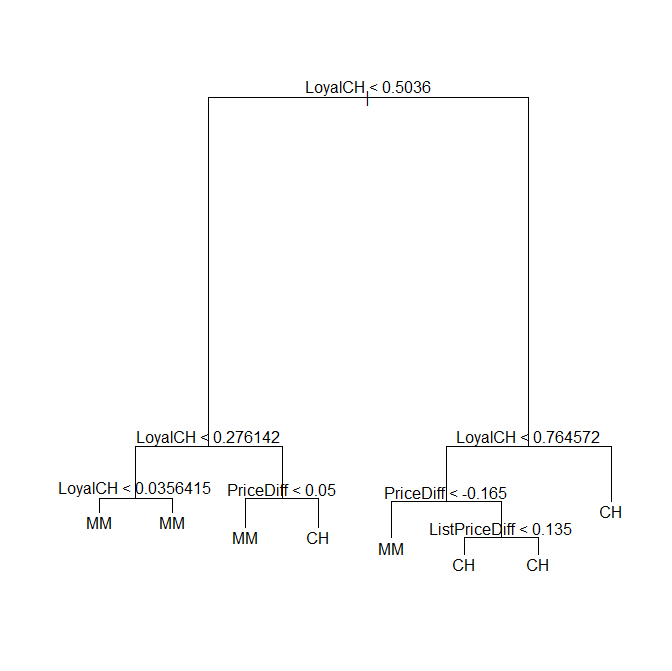
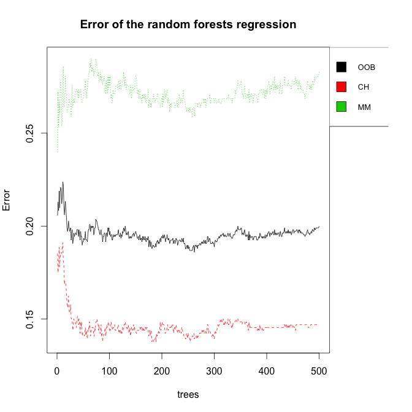

## Tree_OJ

 
 
 
```R
# clear variables and close windows
rm(list = ls(all = TRUE))
graphics.off()

# install and load packages
libraries = c("tree", "ISLR", "randomForest")

lapply(libraries, function(x) if (!(x %in% installed.packages())) {
    install.packages(x)
})
lapply(libraries, library, quietly = TRUE, character.only = TRUE)

# load data
data(OJ)
OJ = data.frame(OJ)

# Build a Tree Model with all Regressors to fit Purchase (can either by MM or CH)
tree.oj = tree(Purchase ~ ., OJ)
# Summary of the Classification tree
summary(tree.oj)
# Plot the Tree Model
plot(tree.oj, main = "Fit of the Regression Tree")
text(tree.oj)

# Compare with RandomForests
random.oj = randomForest(Purchase ~ ., OJ)
dev.new()
plot(random.oj, main = "Error of the random forests regression")
# Summary of the random forests regression
print(random.oj)
# technical details of the random forests regression
summary(random.oj)
 
```
