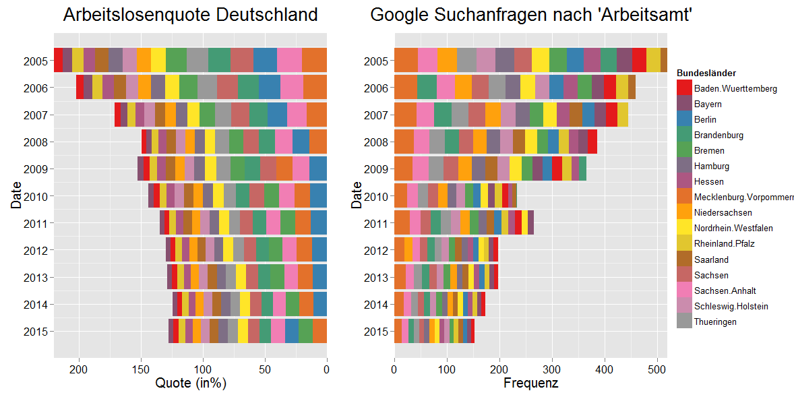

[](http://quantlet.de/index.php?p=info)

## [](http://quantlet.de/) **Unemployment_Google_vs_Official** [](http://quantlet.de/d3/ia)

```yaml

Name of QuantLet : Unemployment_Google_vs_Official

Published in : Frühsignale für Änderungen von Konjunkturindikatoren durch Analysen von Big Data

Description : 'Creates two stacked barplots with legend. It is a panel series. The barplots are
ordered by year and within the plots by amount/frequency. The left barplot shows the unemployment
rate for Germany and its states by amount. The right barplot shows the frequency of the search term
''Arbeitsamt'' for Germany and its states. The bars are plotted all together with a corresponding
legend.'

Keywords : 'time-series, panel-analysis, financial, plot, graphical representation, data
visualization'

Author : Daniel Jacob

Datafile: 
- 1: Google_Arbeitsamt_Bundeslaender_year.csv
- 2: Google_Arbeitsamt_Bundeslaender_monthly.csv
- 3: Arbeitslosenquote_Bundeslaender_year.csv
- 4: Arbeitslosenquote_Bundeslaender_13211-0008.csv

```




### R Code:
```r

# clear variables and close windows
rm(list = ls(all = TRUE))
graphics.off()

# install and load packages
libraries = c("ggplot2", "reshape2", "gridExtra", "grid", "RColorBrewer")
lapply(libraries, function(x) if (!(x %in% installed.packages())) {
    install.packages(x)
})
lapply(libraries, library, quietly = TRUE, character.only = TRUE)

# load data
UnempM = read.csv("Arbeitslosenquote_Bundeslaender_13211-0008.csv", header = TRUE, 
    sep = ";", dec = ",", stringsAsFactors = TRUE)
UnempJ = read.csv("Arbeitslosenquote_Bundeslaender_year.csv", header = TRUE, sep = ";", 
    dec = ",", stringsAsFactors = TRUE)
Google_Unemp = read.csv("Google_Arbeitsamt_Bundeslaender_monthly.csv", header = TRUE, 
    sep = ";", dec = ",", stringsAsFactors = TRUE)
Google_Unemp_J = read.csv("Google_Arbeitsamt_Bundeslaender_year.csv", header = TRUE, 
    sep = ";", dec = ",", stringsAsFactors = TRUE)

# some data frame transformations
Google_Unemp_M = melt(Google_Unemp_J, id.var = "Date")
str(Google_Unemp_M)
Unemp_M = melt(UnempJ, id.var = "Date")
str(Google_Unemp_M)

# GG Plot - stacked Barplot specify Colors
getPalette = colorRampPalette(brewer.pal(9, "Set1"))

# Google Trends Data (search term: 'Arbeitsamt')
Gplot_GoogleA = ggplot(Google_Unemp_M, aes(x = Date, y = value, fill = variable, 
    order = -as.numeric(value))) + geom_bar(stat = "identity", position = "stack") + 
    coord_flip() + scale_fill_manual(values = getPalette(16), guide_legend(title = "Bundesländer")) + 
    scale_y_continuous(expand = c(0, 0)) + scale_x_reverse(breaks = 2005:2015) + 
    ggtitle("Google Suchanfragen nach 'Arbeitsamt'") + ylab("Frequenz") + theme(axis.text = element_text(size = 12))

# Unemployment rate Data via Countries
Gplot_Unemp = ggplot(Unemp_M, aes(x = Date, y = value, fill = variable, order = -as.numeric(value))) + 
    geom_bar(stat = "identity", position = "stack") + coord_flip() + scale_fill_manual(values = getPalette(16), 
    guide_legend(title = "Bundesländer")) + scale_y_continuous(trans = "reverse", 
    expand = c(0, 0)) + scale_x_reverse(breaks = 2005:2015) + ggtitle("Arbeitslosenquote Deutschland") + 
    theme(legend.position = "none") + guides(fill = guide_legend(nrow = 3, byrow = TRUE)) + 
    ylab("Quote (in%)") + theme(axis.text = element_text(size = 12, color = "black")) + 
    theme(axis.title = element_text(size = 15)) + theme(axis.text.y = element_text(size = 12, 
    color = "black")) + theme(axis.title.y = element_text(size = 15)) + theme(plot.title = element_text(size = 20, 
    vjust = 2))

# Collective Legend Step 1: Function to save only the legend
g_legend = function(a.gplot) {
    tmp = ggplot_gtable(ggplot_build(a.gplot))
    leg = which(sapply(tmp$grobs, function(x) x$name) == "guide-box")
    legend = tmp$grobs[[leg]]
    return(legend)
}

# Step 2: Export only the legend from the first plot
leg = g_legend(Gplot_GoogleA)

# Step 3: Remove the legend from the plot
Gplot_GoogleA_oL = ggplot(Google_Unemp_M, aes(x = Date, y = value, fill = variable, 
    order = -as.numeric(value))) + geom_bar(stat = "identity", position = "stack") + 
    coord_flip() + scale_fill_manual(values = getPalette(16), guide_legend(title = "Bundesländer")) + 
    scale_y_continuous(expand = c(0, 0)) + scale_x_reverse(breaks = 2005:2015) + 
    ggtitle("Google Suchanfragen nach 'Arbeitsamt'") + theme(legend.position = "none") + 
    ylab("Frequenz") + theme(axis.text = element_text(size = 12, color = "black")) + 
    theme(axis.title = element_text(size = 15)) + theme(axis.text.y = element_text(size = 12, 
    color = "black")) + theme(axis.title.y = element_text(size = 15)) + theme(plot.title = element_text(size = 20, 
    vjust = 2))
# guides(fill=guide_legend(nrow=3,byrow=TRUE))

# Step 4: Plot the two Graphs and the legend
grid.arrange(arrangeGrob(Gplot_Unemp, Gplot_GoogleA_oL, leg, ncol = 3, widths = c(3/7, 
    3/7, 1/7)))

```
