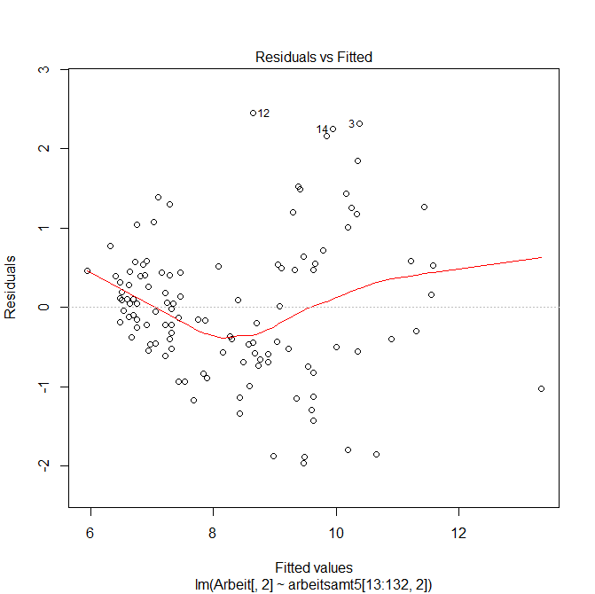
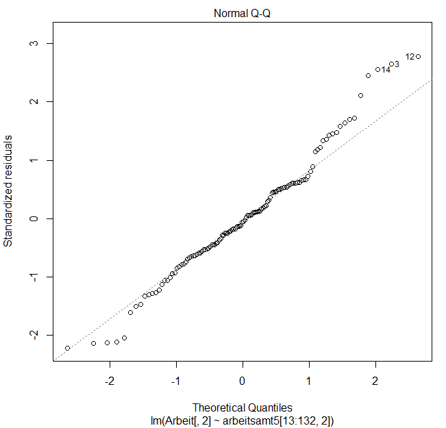
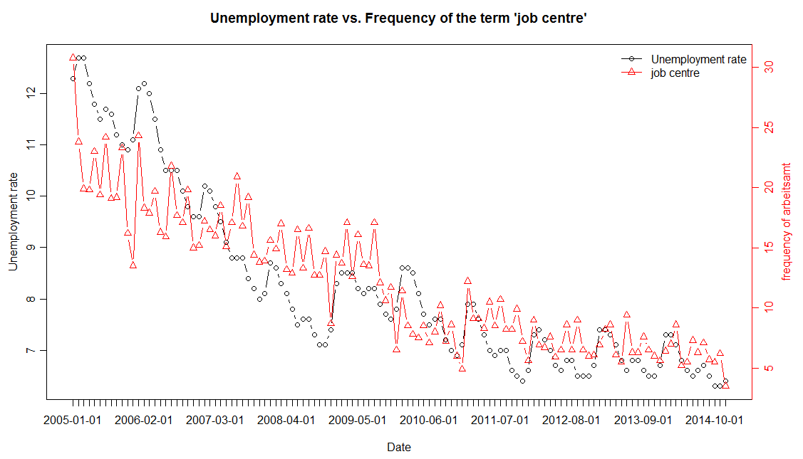

## Unemploymentrate_jobagency_comparison

 
 
 
 
 
 
 
 
```R

# Packages
install.packages("plotrix")
install.packages("devtools")
# devtools needed
install_github("googletrend","okugami79")

library(plotrix)
library(devtools)
library(googletrend)

# See the Message in the "Console" --> "your webbrowser download directory path :
# "path" is your working directory for Google Trend
googletrend::setdownloaddir("path")

# Load Unemployment rate (quarterly adjusted)
Arbeit <- read.csv("Arbeitslosenquote.csv",header=TRUE,sep=";",dec=",")

#Plot 1
plot(Arbeit[,"Arbeitslosenquote"],type="l",pch=1,col="red",xaxt="n",xlab="Date",ylab="unemployment rate",ylim=c(5,13),lwd=2,
	main = "Plot of the German unemployment rate")
# 2. X-Axis = Date
axis(1,at=c(1:nrow(Arbeit)),labels=Arbeit[,"Jahre"])

# Plot 2
# Descriptive Statistics
summary(Arbeit)
dev.new()
boxplot(Arbeit[,-1], ylab="Unemployment rate")

# New Data with Word "labor bureau (Arbeitsamt)"
# using Google Trend
arbeitsamt <- gettrend(keyword="Arbeitsamt", geo="DE", use.monthly=TRUE)

# Divide Numbers by Ten (for a better overview)
ten <- matrix(10, ncol=1, nrow=142)
arbeitsamt2 <- cbind(arbeitsamt, ten)
arbeit_ten <- apply(arbeitsamt2[,-1],2,function(x) (x/ten))
arbeit_ten <- as.data.frame(arbeit_ten)
arbeitsamt3 <- cbind(arbeitsamt[,1],arbeit_ten[,1])
arbeitsamt4 <- cbind(arbeitsamt2, arbeitsamt3[,2])
arbeitsamt5 <- arbeitsamt4[,-c(2,3)]

# Linear Regression (OLS-Method) With Unemployment rate vs. Google Words
lm_unemp_arbeitsamt <- lm(Arbeit[,2]~arbeitsamt5[13:132,2])
summary(lm_unemp_arbeitsamt)

# Plot 3
dev.new()
plot(Arbeit[,2]~arbeitsamt5[13:132,2], ylab="official Unemployment rate", xlab="Frequency of the term 'job centre'", main="Scatter plot")
abline(lm_unemp_arbeitsamt, col="red")

# Plot 4: more graphical representations of the Linear Regression
dev.new()
plot(lm_unemp_arbeitsamt)

# Plot 5: 'job centre' (Arbeitsamt) vs. Unemployment rate
dev.new()
twoord.plot(lx=arbeitsamt5[13:132,1],ly=Arbeit[,2],rx=arbeitsamt5[13:132,1],ry=arbeitsamt5[13:132,2],
			xtickpos=as.numeric(arbeitsamt5[13:132,1]),xticklab=as.character(arbeitsamt5[13:132,1]), xlab="Date",
            ylab="Unemployment rate", rylab="frequency of arbeitsamt", main="Unemployment rate vs. Frequency of the term 'job centre'")
legend("topright",col=c("black","red"),
       pch=1:2,c("Unemployment rate","job centre"),
       lty=1,lwd=1, cex=1, bty='n')

```
